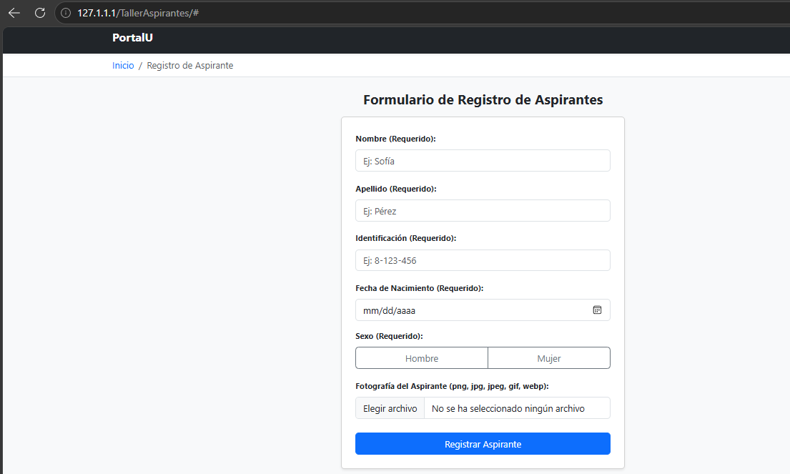
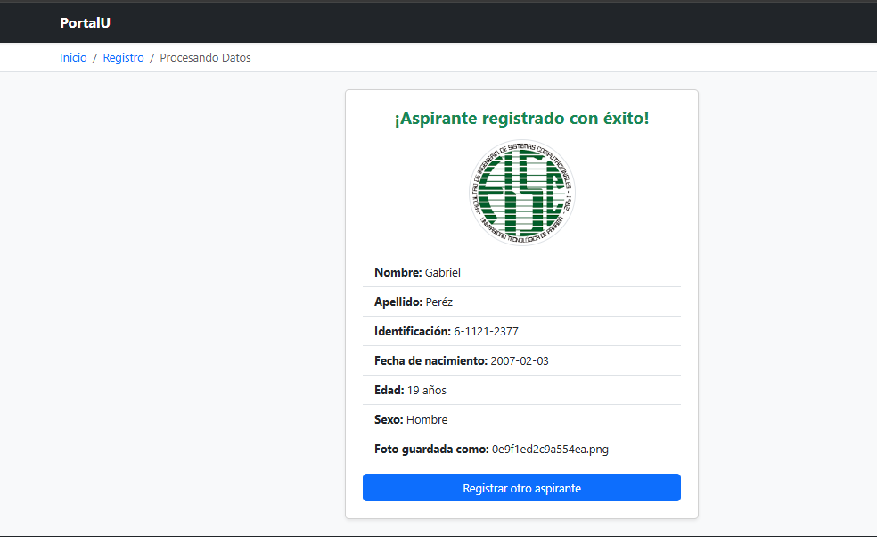

# Taller: Registro de Aspirantes (Laboratorio #3)
--Estudiante: Gabriel Mendoza 8-1038-1624

Objetivo realizar un Formulario web de registro de aspirantes desarrollado con **HTML5, Bootstrap 5.3.8 y PHP**, sin base de datos. 
Que Valide los datos en el servidor, estandariza los textos y guarda la fotografía del aspirante de forma segura.


## Inicio del Formulario 
<p align="center">
  
</p>


## Registro de usuario

<p align="center">
  
</p>


## Estructura del proyecto

```
-Laboratorio-3-Include---Formularios-HTML5/
├── .htaccess             # Bloquea el acceso a las fotos desde el navegador
├── ImagenPortada.png     # Imagen de portada del README
├── Registro.png          # Captura del formulario de registro
├── Index.php             # Formulario de registro
├── procesar.php          # Backend: valida, formatea y guarda
├── header.php            # Metadatos, <header>, navbar y breadcrumb dinámico
├── footer.php            # <footer> con enlaces y año dinámico
└── README.md
```

## Requisitos

- PHP 8.0 o superior (usa `random_bytes`, `finfo` y funciones `mb_*`)
- Extensiones PHP habilitadas: `mbstring` y `fileinfo`
- Apache con `AllowOverride All` (para que funcione el `.htaccess`). WAMP lo trae por defecto en la mayoría de configuraciones
- Conexión a internet para cargar Bootstrap desde CDN (jsDelivr)


## Funcionamiento

### Formulario (`Index.php`)

Campos obligatorios, todos con `required` y `placeholder`:

| Campo | Tipo |
|---|---|
| Nombre | `text` |
| Apellido | `text` |
| Identificación | `text` |
| Fecha de nacimiento | `date` |
| Sexo | `radio` (Hombre / Mujer) |
| Fotografía | `file` (png, jpg, jpeg, gif, webp) |

El formulario usa `method="POST"` y `enctype="multipart/form-data"`, necesario para enviar la imagen al servidor.

### Procesamiento (`procesar.php`)

1. **Saneamiento:** `trim()` y `strip_tags()` al recibir los datos; `htmlspecialchars()` al mostrarlos (previene XSS).
2. **Validación de campos:** ninguno puede quedar vacío; nombre y apellido solo aceptan letras; la identificación solo letras, números y guiones; el sexo debe ser uno de los valores permitidos.
3. **Estandarización:** nombre y apellido a formato tipo título (`sofia` → `Sofia`) con `mb_convert_case`, que respeta las tildes; identificación en mayúsculas con `strtoupper()`.
4. **Edad:** se calcula a partir de la fecha de nacimiento y debe estar entre **18 y 70 años**. Se rechazan fechas inválidas o futuras.
5. **Fotografía:** se valida la extensión y el tamaño (máx. 2 MB), y se comprueba con `finfo` y `getimagesize()` que el contenido sea realmente una imagen. Se guarda con un nombre aleatorio en `uploaded_files/`.
6. **Resultado:** si hay errores se listan con un enlace para volver al formulario; si todo es correcto se muestra la ficha del aspirante.

### Modularización con `include`

`header.php` y `footer.php` se incluyen en ambas páginas. El breadcrumb cambia según la página usando `basename($_SERVER['PHP_SELF'])`:

- En `Index.php`: Inicio / Registro de Aspirante
- En `procesar.php`: Inicio / Registro / Procesando Datos

## Seguridad

- **Carpeta de fotos protegida:** `uploaded_files/.htaccess` deniega todo acceso directo por URL (responde 403). Las fotos no se sirven por enlace; `procesar.php` las lee desde PHP y las muestra incrustadas (data URI).
- **Nombres de archivo aleatorios:** evita colisiones y nombres maliciosos enviados por el usuario.
- **Validación en el servidor:** no se confía solo en los atributos HTML del formulario.
- **Escape de salida:** todo dato del usuario se imprime con `htmlspecialchars()`.
- **Metadato `robots`:** `noindex, nofollow` para que los buscadores no indexen el formulario.


## Tecnologías

HTML5 semántico (`<header>`, `<main>`, `<section>`, `<footer>`), Bootstrap 5.3.8 (CDN) y PHP.
